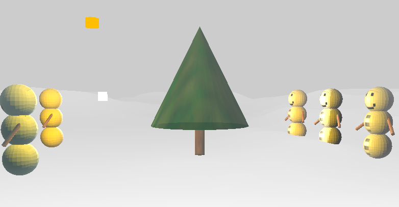
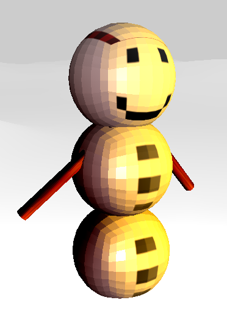
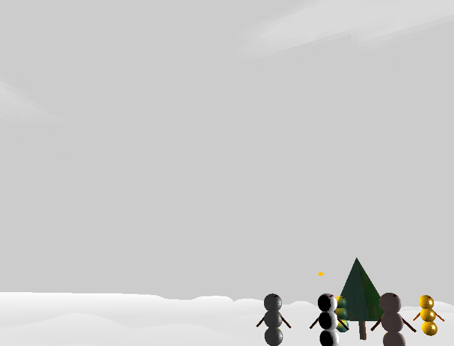
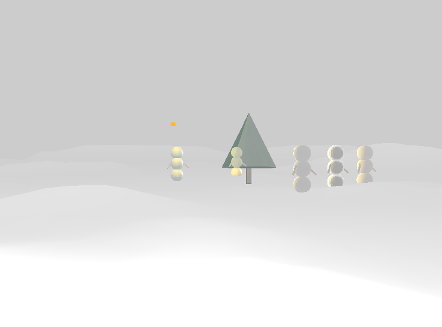

# 4th year Graphics Project

OpenGL project for CSU44052 Computer Graphics.

## Basic Features

### Crowd of animated snow-people

### Texture mapping of scene and characters

### Implementation of Phong illumination model

## Advanced Features

### Heightmap

### Partial transparency using Alpha blending

### Skybox (using cubemap)

### Fog

